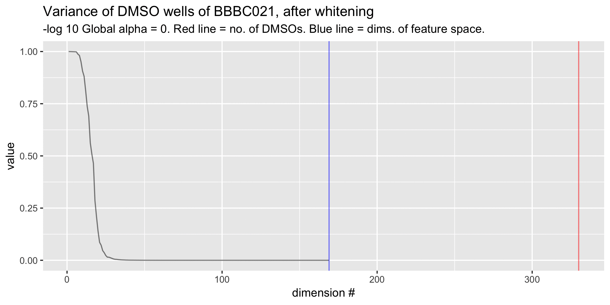
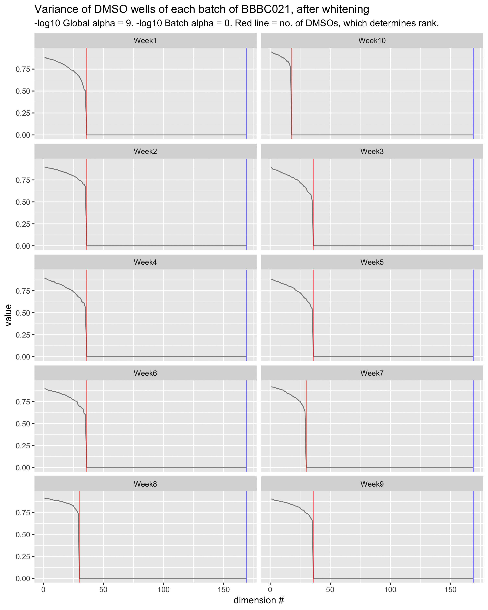

# Experiments with whitening 

(see http://rpubs.com/shantanu/whitening for math rendering)

The regularization parameter $\epsilon$ (here, varied from $1$ to $10^{-9}$) determines the shape of the curve below, 
which shows the eigenvalues of the whitened covariance matrix: 

$\hat{\sigma_{i}} = \sigma_{i}/(\sigma_{i} + \epsilon)$, 
where $\hat{\sigma_{i}}$ is the $i^{th}$ eigenvalue of the whitened covariance matrix, $\sigma_{i}$ is the $i^{th}$ eigenvalue of the original covariance matrix. 

Setting $\epsilon = \sigma_{j}/10$ gives $\hat{\sigma_{j}} \approx 0.9$, i.e., the curve will drop to $0.9$ by the $j^{th}$ eigenvector. 

A reasonable heuristic is select $j$ to be the estimated "true" dimensionality of the data.

Whitening per batch is not a good idea because the covariance matrices are typically very low rank (unless there are sufficiently many DMSOs per batch)

